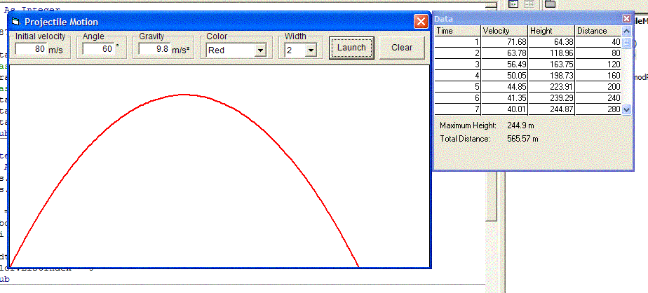



## Projectile Motion \(Trajectory path\) ACCURATE PHYSICS

### Description

This program uses accurate physics formulas to plot the path of a trajectory given an initial velocity and angle.

all of the physics related code has been placed in a module so it should be pretty easy to use in your own program. all of the code is heavily commented so even if you're shaky on newtonian physics it should be pretty easy to follow.

i spent more time focusing on the physics part of the program and not so much the "VB" part. so if anybody could explain why the program crashes after i clear and the re-fire, that would be great.
 
### More Info
 

             |
---                |---
**Submitted On**   |2006-01-17 21:42:52
**By**             |[Joe Shmoe](https://github.com/Planet-Source-Code/PSCIndex/blob/master/ByAuthor/joe-shmoe.md)
**Level**          |Intermediate
**User Rating**    |5.0 (15 globes from 3 users)
**Compatibility**  |VB 5\.0, VB 6\.0
**Category**       |[Math/ Dates](https://github.com/Planet-Source-Code/PSCIndex/blob/master/ByCategory/math-dates__1-37.md)
**World**          |[Visual Basic](https://github.com/Planet-Source-Code/PSCIndex/blob/master/ByWorld/visual-basic.md)
**Archive File**   |[Projectile1966031172006\.zip](https://github.com/Planet-Source-Code/joe-shmoe-projectile-motion-trajectory-path-accurate-physics__1-64073/archive/master.zip)

